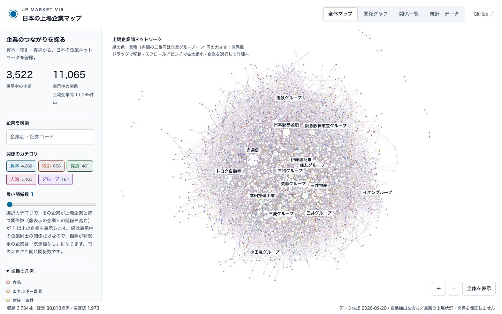
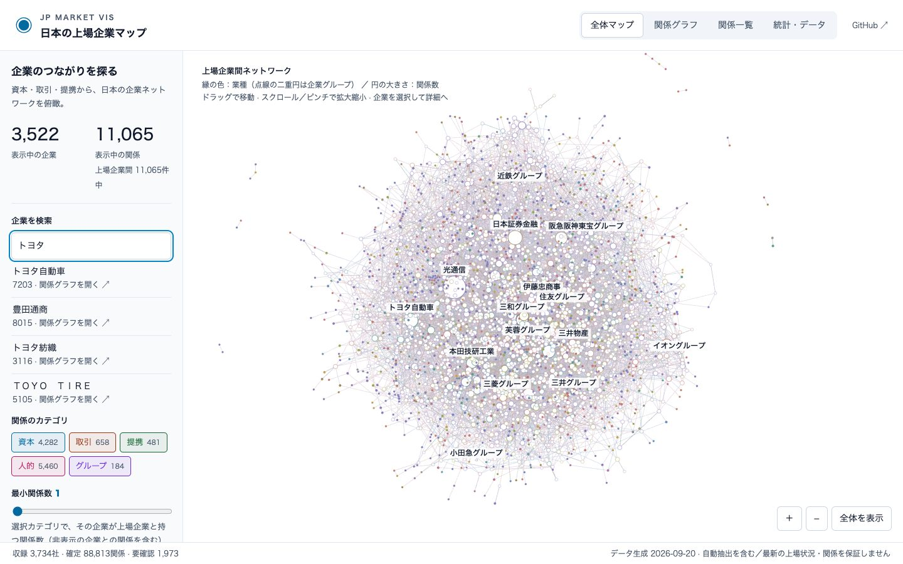
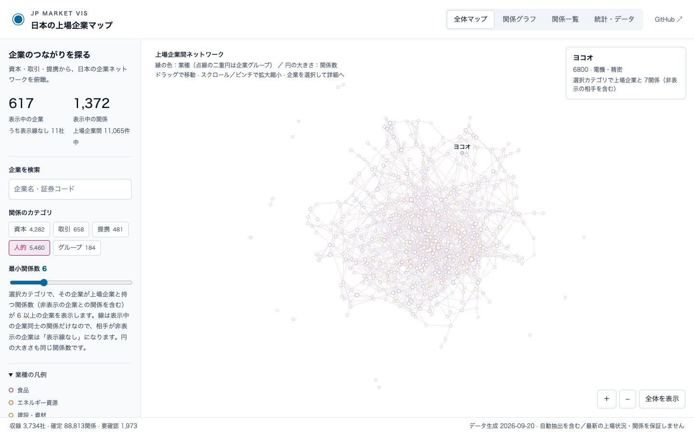
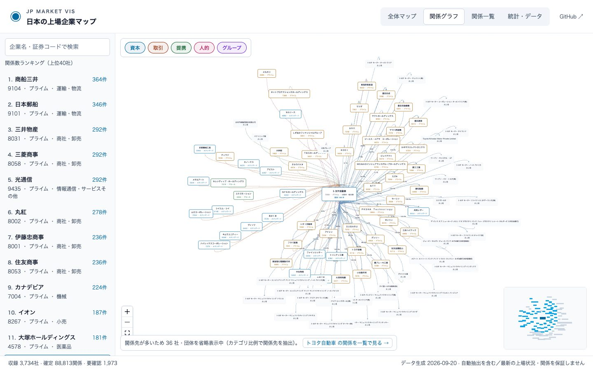
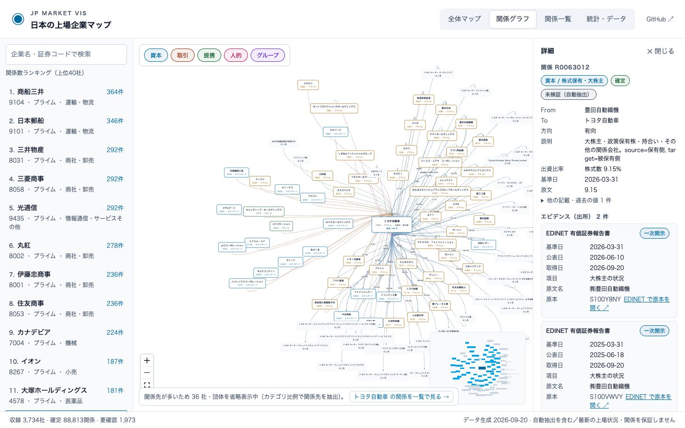
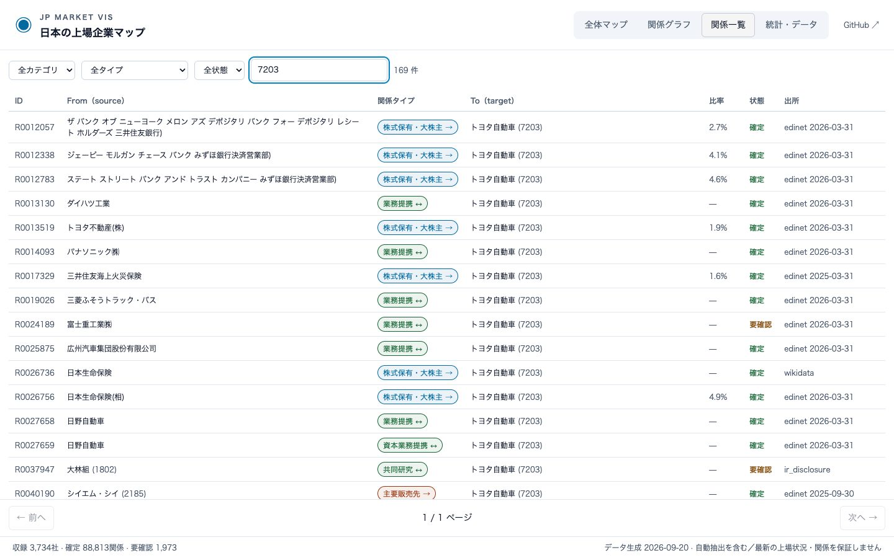
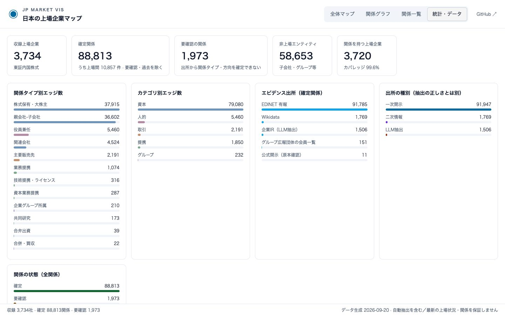

# JP Market Vis — 日本の上場企業マップ

[](LICENSE)

公開情報から、日本の上場企業同士の**資本・取引・提携・人的（役員兼任）・グループ**の関係を集め、ブラウザで探索できるようにした静的 Web アプリです。

**東証プライム・スタンダード・グロースの内国株式 3,734 社を対象に、確定関係 88,813 件（上場企業間は約 11,000 件）を収録しています。** 各関係には出所（有価証券報告書の書類 ID・Wikidata の項目・公表資料の URL）、基準日、根拠文を付け、画面から原本へたどれます。

使い方ガイド更新：2026年9月21日。データは 2026年9月20日 生成で、有価証券報告書は 2025年6月14日〜2026年6月13日 提出分、上場企業一覧は 2026年6月13日 時点です。現在の株主構成や取引を保証するものではありません。

**公開ページ（GitHub Pages）：https://mattyamonaca.github.io/JP_Market_Vis/**

HTML・JavaScript・CSS・JSON だけで動作し、外部 API・バックエンド・API キーは不要です。初回データは gzip 転送で約 2.7MB（展開後 約 43MB）、根拠文の全文（約 54MB）は分割ファイルにあり、詳細を開いたときに該当分だけ読み込みます。

## ドキュメント案内

| 調べたいこと | 読む文書 |
|---|---|
| サイトの使い方・収録データの概要・注意点 | この README |
| データをどう取得・解析・名寄せしているか、関係タイプの判定規則 | [pipeline/README.md](pipeline/README.md) |
| どこまで確かめられているか（自動監査とサンプル判定） | [2026-09-20 の再生成レポート](reviews/2026-09-20-regeneration/REPORT.md)、[2026-09-09 の再生成レポート](reviews/2026-09-09-regeneration/REPORT.md) |
| 原本で確認した訂正の記録 | [pipeline/corrections.json](pipeline/corrections.json) |
| 実際のブラウザ操作での確認結果（スクリーンショット付き） | [qa/results/](qa/results/) の日付の新しいディレクトリ |
| 出所別・信頼度別の件数 | 画面の「統計・データ」 |

## 可視化サイトの使い方

**[日本の上場企業マップを開く](https://mattyamonaca.github.io/JP_Market_Vis/)**

企業を探し、その企業がどの企業とどんな関係（資本・取引・提携・役員兼任・グループ）を持つかを、出所とともに確認できます。

> 画面は **2026年9月21日撮影時点**の例です。数値・配置はデータ更新で変わります。全体マップの配置は力学計算による見やすさのためのもので、地理や業績の意味はありません。

### 1. 画面の見方



| 場所 | できること |
|---|---|
| 上部のタブ | 「全体マップ」「関係グラフ」「関係一覧」「統計・データ」を切り替える。切り替えても各画面の状態（検索語・絞り込み・視点・中心企業と履歴・ページ）は保持される |
| 左の「企業を検索」 | 企業名・通称・読み・証券コードで企業を探す |
| 左の「関係のカテゴリ」「最小関係数」 | 全体マップに表示する関係の種類と、表示する企業の関係数の下限を決める |
| 中央のマップ | 上場企業を円、関係を線で描く。縁の色は業種（凡例は左下）、円の大きさは関係数。点線の二重円は企業グループのハブ |
| 円にホバー | 企業名・証券コード・業種・選択カテゴリでの関係数を右上に表示。円の中や上に企業名が出るのは、円が大きい企業と拡大したときだけ |
| 右下の「＋」「−」「全体を表示」 | 拡大・縮小と、初期の倍率・位置への復帰 |
| 下部のフッター | 収録社数・確定関係数・要確認件数・データ生成日 |

マップの操作は、ドラッグで移動、スクロール／ピンチで拡大縮小です。円をクリック（動かさずに離す）すると、その企業の関係グラフへ進みます。ドラッグの終了では開きません。

### 2. 企業を検索する

例として、**トヨタ自動車**の関係を調べます。

1. 左の「企業を検索」に「トヨタ」と入力します。
2. 候補に「トヨタ自動車 7203」「豊田通商 8015」「トヨタ紡織 3116」などが並びます。通称・読み（「とよた」）・証券コード（「7203」「７２０３」）でも探せます。
3. 「トヨタ自動車」を選ぶと、関係グラフがトヨタ自動車を中心に開きます。



検索は収録している全 3,734 社が対象です。全体マップに描かれるのは、選択中のカテゴリで他の上場企業と関係のある企業だけです。

### 3. 関係のカテゴリと最小関係数で絞る

「関係のカテゴリ」の各ボタンで、表示する関係の種類を選びます。ボタンの数字は、そのカテゴリで上場企業同士を結ぶ線の本数です。

例として **「人的」だけを残し、最小関係数を 6** にすると、6 社以上と役員を兼任し合う企業だけが残ります（撮影時 617 社）。



- **最小関係数**は「選択カテゴリで、その企業が上場企業と持つ関係の数」で判定します。相手が閾値未満で非表示になった関係も数に入るため、線のない企業（「表示線なし」）が残ることがあります。
- **企業グループ**（三菱・三井・住友・三和など）は、会員が 2 社以上あるものを点線の二重円のハブとして描き、会員の上場企業と線で結びます。ハブにホバーすると団体名と会員数が出ます。ハブはクリックしても関係グラフを開きません。
- 「未収録」と表示されたカテゴリは、収集していないことを示します。関係がないことを意味しません。

### 4. 関係グラフで 1 社の関係を見る

中心企業から 1 ホップの関係先を、カテゴリ別の色の線で描きます。非上場の関係先（子会社・大株主・契約相手）も含みます。



- 上部のカテゴリボタンで表示する関係を絞れます。ノードにホバーすると接続する線を強調し、線にホバーすると関係タイプを表示します。
- 上場企業のノードをクリックすると、その企業を中心に移動します。「← 戻る」で履歴をたどれます。左のランキングは関係数の多い上場企業の上位 40 社です。
- 関係先が多い企業は約 90 件に省略して表示し、省略数と「関係を一覧で見る」のリンクを出します。

### 5. 関係の詳細とエビデンスを読む

線（関係）または非上場のノードをクリックすると、右に詳細が開きます。



| 表示 | 意味 |
|---|---|
| カテゴリ／関係タイプ | 例: 資本／株式保有・大株主。定義は下の「関係タイプ」を参照 |
| 状態 | **確定**＝出所の記載どおりに抽出できた関係、**要確認**＝分類不明・方向の矛盾・根拠不足などで確定できない関係、**過去**＝後続の開示で過去の状態になった関係。全体マップ・ランキング・統計は確定関係だけを数える |
| 検証 | **未検証（自動抽出）**が既定。人手で原本と照合した関係だけに**原本で検証済み**が付く |
| From／To／方向 | 有向の関係（親会社→子会社、保有側→被保有側など）と無向の関係（業務提携、役員兼任） |
| 出資比率・売上比率・兼任者・契約年月 | 関係タイプごとの属性。出資比率は合計（直接＋間接）で、複数の書類で値が異なる場合は基準日の新しい値を現在値にし、「他の記載・過去の値」に残りを示す |
| エビデンス | 出所ごとのカード。**出所種別**（一次開示＝有価証券報告書・公式開示、二次情報＝Wikidata、LLM 抽出＝企業 IR サイトの自動抽出）、**基準日**（有報は期末、大株主は「…現在」の日付、IR は公表日。不明なら「不明」）、公表日、取得日、項目、原文名、根拠文、原本へのリンク |

「一次開示」は出所の種別で、抽出が正しいことを意味しません。役員兼任では、根拠文は有価証券報告書「役員の状況」の略歴行（例:「2024年６月 ○○株式会社社外取締役（現任）」）で、提出日現在の情報です。

### 6. 関係一覧で全件を調べる

「関係一覧」では、カテゴリ・関係タイプ・企業名・証券コードで絞り込み、300 件ずつページ送りして全件を確認できます。行をクリックすると同じ詳細パネルが開きます。関係グラフで省略された関係先も、ここでは全件見られます。



### 7. 統計・データで出所と件数を確認する

「統計・データ」では、関係タイプ別・出所別・信頼度別・状態別の件数、ハブ企業ランキング、データの対象と制約を確認できます。出所別・信頼度別はエビデンスの件数で、関係数とは一致しません。



### 8. キーボードで操作する

Tab で検索欄・カテゴリボタン・マップ領域・拡大縮小ボタンに順に移動できます。マップ領域にフォーカスしたときの操作は次のとおりです。

| キー | 動作 |
|---|---|
| 矢印キー | 表示位置を上下左右に移動 |
| ＋ ／ − | 拡大 ／ 縮小 |
| 0 ／ Home | 全体を表示（初期の倍率・位置に戻る） |

## 収録データ

| 項目 | 内容 |
|---|---|
| 生成日／データバージョン | 2026-09-20／2026.09 |
| 収録上場企業 | 3,734 社（プライム 1,564・スタンダード 1,575・グロース 595。上場企業一覧は 2026-06-13 時点） |
| 関係 | 確定 88,813 件、要確認 1,973 件、過去 1 件（計 90,787 件） |
| 非上場等の関係先 | 58,653 件（子会社・大株主・契約相手・企業グループなど） |
| 有価証券報告書 | 2025-06-14〜2026-06-13 提出分 3,939 件（EDINET API v2） |
| 企業グループ会員一覧 | 三菱広報委員会・三井広報委員会・住友グループ広報委員会・みどり会の公式サイト（会員 263 社のうち上場会員 183 社を登録、2026-09-20 取得） |

### 関係タイプ

| カテゴリ | 関係タイプ | 定義 | 確定件数 | うち上場企業間 | 主な出所 |
|---|---|---|---|---|---|
| 資本 | 親会社-子会社 | 議決権の過半数、または連結財務諸表上の実質支配。親会社→子会社 | 36,602 | 313 | 有報「関係会社の状況」、Wikidata |
| 資本 | 関連会社 | 持分法適用の関連会社等。投資側→関連会社 | 4,524 | 418 | 有報「関係会社の状況」 |
| 資本 | 株式保有・大株主 | 大株主・政策保有株・持合い・その他の関係会社。保有側→被保有側 | 37,915 | 3,519 | 有報「大株主の状況」、Wikidata、企業 IR |
| 資本 | 合弁出資 | 合弁会社への共同出資。出資者→合弁会社 | 39 | 9 | 企業 IR |
| 取引 | 主要販売先 | 連結売上の 10% 以上の顧客など。販売側→顧客 | 2,191 | 656 | 有報「主要な顧客」 |
| 提携 | 業務提携 | 業務提携・販売提携・協業・合弁契約の当事者同士（無向） | 1,074 | 242 | 有報「経営上の重要な契約等」、企業 IR |
| 提携 | 資本業務提携 | 資本参加を伴う業務提携（無向） | 287 | 144 | 有報「経営上の重要な契約等」、企業 IR |
| 提携 | 技術提携・ライセンス | 技術援助・特許実施権の許諾など。供与側→受領側 | 316 | 41 | 有報「経営上の重要な契約等」 |
| 提携 | 共同研究 | 共同研究・共同開発（無向） | 173 | 54 | 企業 IR、有報「経営上の重要な契約等」 |
| 人的 | 役員兼任 | 同一人物が両社の役員を兼任（無向） | 5,460 | 5,460 | 有報「役員の状況」 |
| グループ | 企業グループ所属 | 系列・企業グループへの所属。企業→グループ | 210 | （ハブ 184 本） | グループ広報団体の会員一覧、Wikidata |
| グループ | 合併・買収 | 存続／買収側→消滅／被買収側 | 22 | 0 | 企業 IR |

主要仕入先・主要借入先は定義のみで、現在は収録していません。技術提携のうち「導入」「供与」の語から方向を決められないものは要確認にしています。

### データ出所

| 提供元 | 使用する情報 | 本プロジェクトでの用途・取得時点 |
|---|---|---|
| **[JPX 東証上場銘柄一覧](https://www.jpx.co.jp/markets/statistics-equities/misc/01.html)** | 内国株式の銘柄名・証券コード・市場区分・業種 | 上場企業マスター（2026-06-13） |
| **[金融庁 EDINET](https://disclosure2.edinet-fsa.go.jp/)** | EDINET コードリスト、有価証券報告書（関係会社の状況・大株主の状況・主要な顧客・役員の状況・経営上の重要な契約等） | 資本・取引・人的・提携の関係と、書類 ID・基準日・根拠文（関係会社・大株主・主要顧客は 2026-09-09、役員の状況・重要な契約等は 2026-09-20 取得） |
| **[Wikidata](https://www.wikidata.org/)** | 親組織・子会社・所有者・所有物・所属（P355/P749/P127/P1830/P463）と法人番号・QID の対応 | 資本関係・グループ所属の補完と名寄せ（2026-06-13 のスナップショット） |
| **企業グループ広報団体の公式サイト**（[三菱広報委員会](https://www.mitsubishi.com/ja/profile/csr/mpac/companies/)・[三井広報委員会](https://www.mitsuipr.com/members/)・[住友グループ広報委員会](https://www.sumitomo.gr.jp/org/company/)・[みどり会](https://www.midorikai.co.jp/member_company)） | 会員会社一覧 | 企業グループ所属（2026-09-20）。芙蓉懇談会・三金会は公式の会員一覧が公開されていないため未収録 |
| **各社の IR サイト**（ニュースリリース） | 提携・出資・合弁・共同研究などの公表文 | LLM（moonshot-v1-32k）で構造化した関係。根拠文の検証に通ったものだけ確定、それ以外は要確認（2026-06-13 のスナップショット、対象 1,813 社） |
| **公式開示（原本確認）** | 監査で原本を確認した訂正 | `pipeline/corrections.json` に記録した訂正の適用 |

各社の IR サイトへの URL は関係詳細に表示します。収録データ・引用元には各提供元の利用条件が適用されます。

### 対象と限界

- 地方単独上場、ETF、REIT 等は対象外です。非上場の関係先はエンティティとして名寄せしていますが、法人番号や QID がない名前は表記ゆれが残ることがあります。
- 自動抽出・名寄せ・LLM による IR 抽出を含み、誤り・欠落・古い関係が残る可能性があります。正誤の全件確認は実施していません。関係がない表示は、現実に関係がないことを意味しません。
- 親子関係は議決権の過半数だけでなく連結上の実質支配を含む定義です。役員兼任は提出日現在の記載で、その後の退任は反映されません。提携は「経営上の重要な契約等」に記載されたものに限ります。
- 監査の方法と結果（既知の訂正ケース、層化サンプルの判定、見つかった誤りの型）は再生成レポートを参照してください。2026-09-20 のレポートでは、新設した出所のサンプル判定は根拠文の読み合わせで行っており、人手で原本 PDF と照合したものではないことを明記しています。

## 開発

Node.js 22 と npm を使用します。

```sh
npm ci
npm run dev        # http://localhost:5184/JP_Market_Vis/
npm test           # 関係の参照整合性・ID 重複・出所、検索、フィルタ、配色のテスト
npm run build      # dist/ に公開成果物
npm run preview
```

主なファイルは次のとおりです。

| パス | 内容 |
|---|---|
| `public/M4_companies.json` | 上場企業マスター（名称・別名・読み・業種・市場区分・法人番号・EDINET コード・QID） |
| `public/M5_company_relations.json` | 関係の本体（関係タイプ定義・エンティティ・関係。エビデンスは要約） |
| `public/evidence/<shard>.json` | 関係 ID ごとのエビデンス全文（基準日・原本 URL・書類 ID・根拠文・出資比率の内訳と履歴） |
| `src/data/graph.js` | データの読み込み、隣接索引、全体マップ用グラフ、統計 |
| `src/components/GlobalMap.jsx` | 全体マップ（react-force-graph-2d / Canvas） |
| `src/App.jsx`、`src/components/` | 関係グラフ（React Flow）・関係一覧・統計・詳細パネル |
| `pipeline/` | データ生成パイプライン（取得・解析・統合・公開データ生成・監査） |
| `qa/run_qa.mjs` | Playwright による実操作の確認 |

## GitHub Pages

[Vite の GitHub Pages ガイド](https://vite.dev/guide/static-deploy.html#github-pages)に従い、`vite.config.js` に `base: '/JP_Market_Vis/'` を設定しています。データ取得にも `import.meta.env.BASE_URL` を使います。

`.github/workflows/pages.yml` の [Pages ワークフロー](https://docs.github.com/en/pages/getting-started-with-github-pages/using-custom-workflows-with-github-pages)が、`main` への push でテスト・ビルド後に `dist/` を公開します（リポジトリの **Settings → Pages → Source** を **GitHub Actions** に設定）。PR ではテストとビルドだけを実行します。別名のリポジトリに移す場合は Vite の `base` を変更してください。ハッシュやサーバー側のルーティングに依存しない単一ページです。

## データの更新と再生成

公開データは `pipeline/` で生成します。Python 3.14（外部依存は `requests` のみ）で、EDINET の再取得には `EDINET_API_KEY` が必要です。認証情報はリポジトリに含めていません。

```sh
cd pipeline
python3 fetch_edinet_filings.py list --from 2025-06-14 --to 2026-06-13   # 対象書類の一覧
python3 fetch_edinet_filings.py fetch          # 生ブロックをキャッシュ（全書類で約 4 時間。取得済みの種別はスキップ）
python3 fetch_group_members.py                 # グループ広報団体の会員会社一覧
python3 parse_edinet_filings.py                # キャッシュを解析（約 15 分、オフライン）
python3 build_masters.py                       # 各出所を統合して M4/M5 を生成
python3 make_viz_data.py                       # public/ へ出力
python3 audit.py --old <旧 M5> --old-m4 <旧 M4> --out ../reviews/<日付>-regeneration   # 監査とサンプル抽出
```

`public/M4_companies.json` と `public/M5_company_relations.json`、`public/evidence/` は同じスナップショットの組で置き換え、`npm test` と `npm run build` を実行します。README の件数・生成日も更新してください。取得・解析・名寄せ・関係タイプの判定規則、IR 抽出の根拠判定、比率や訂正の扱いは [pipeline/README.md](pipeline/README.md) にまとめています。

## 実操作の確認

`qa/run_qa.mjs` が Playwright とローカルの Chrome で、PC（1440×900）・200% 拡大相当・タッチ（390×844、エミュレーション）・キーボード・ロード画面のシナリオを実行し、`qa/results/<日付>/` にスクリーンショット・結果 JSON・レポートを残します。

```sh
npm run dev                    # 別ターミナル
npm i -D --no-save playwright
node qa/run_qa.mjs             # http://localhost:5184/JP_Market_Vis/ を対象
```

`QA_LABEL=issue-23` のように付けると出力先が `qa/results/<日付>-issue-23/` になります。不合格があると終了コード 1 で終わります。

## ライセンス

本プロジェクトのコード・文書は **Apache License 2.0** です（[LICENSE](LICENSE)）。収録データ・引用元（JPX、EDINET、Wikidata、各グループ広報団体・各社の公表資料）には各提供元の利用条件が適用されます。

## 経緯

既存の `persona_project/visualize/company_relations_vis` を移植し、React 18 / Vite 6 / React Flow の構成とデータを継承しました。全体マップを初期画面にし、検索・表示調整・モバイル用レイアウト・ロード／エラー表示・一覧ページ送りを追加しています。全体マップは一時 react-force-graph-3d の 3D 表示にしましたが、視点操作が分かりづらいため react-force-graph-2d の平面表示に戻しました。データ生成パイプラインも同プロジェクトから移管し、2026 年 9 月に有価証券報告書の再取得・再解析と、人的・グループ・提携の拡充を行いました。
