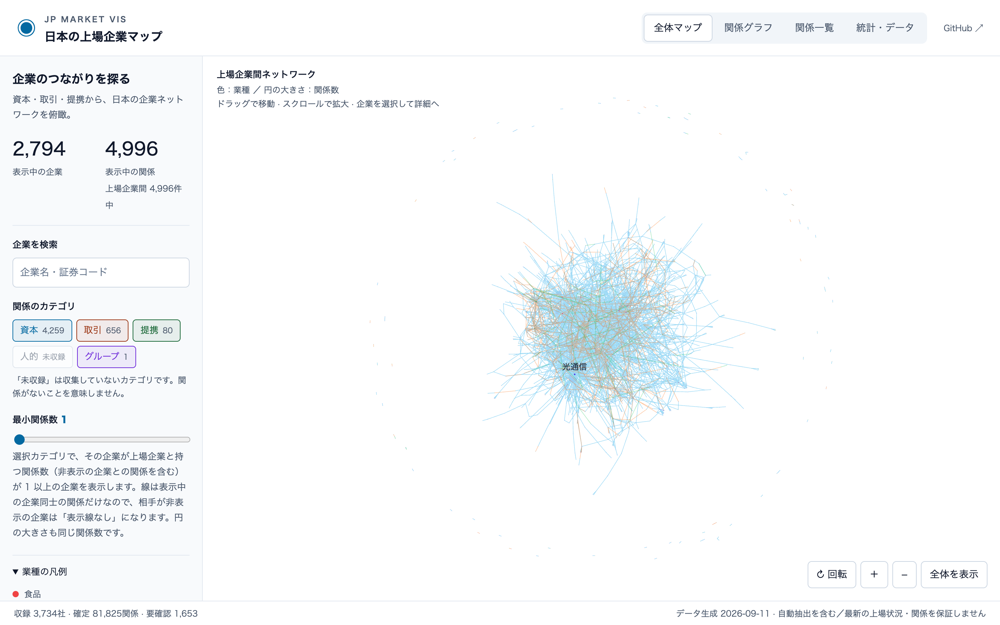
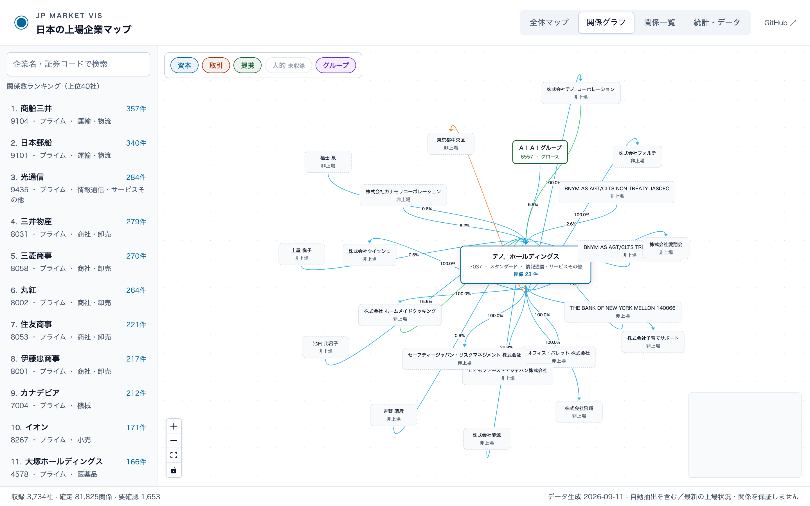
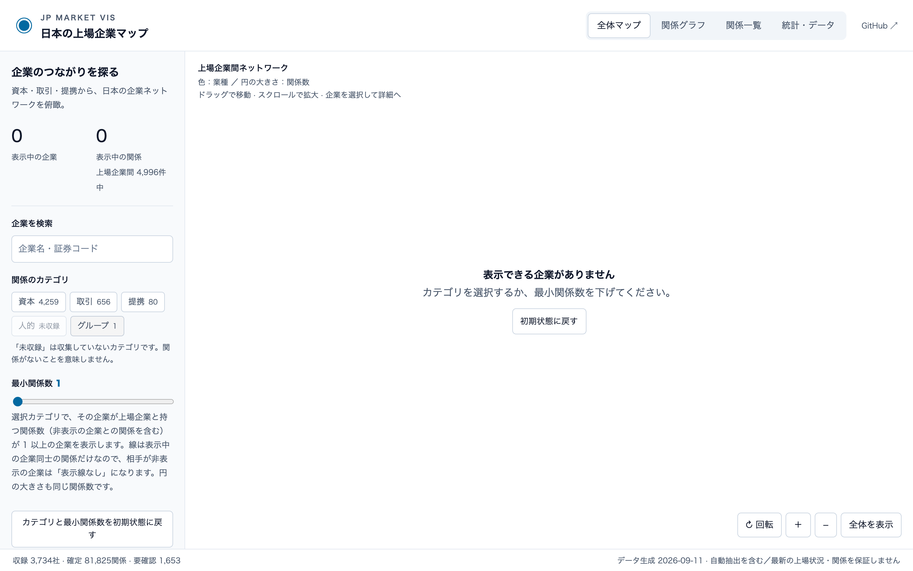
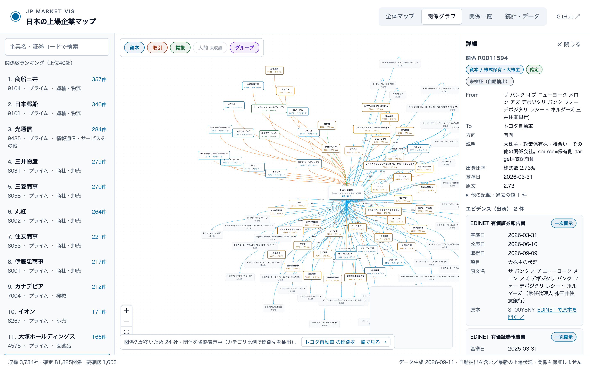
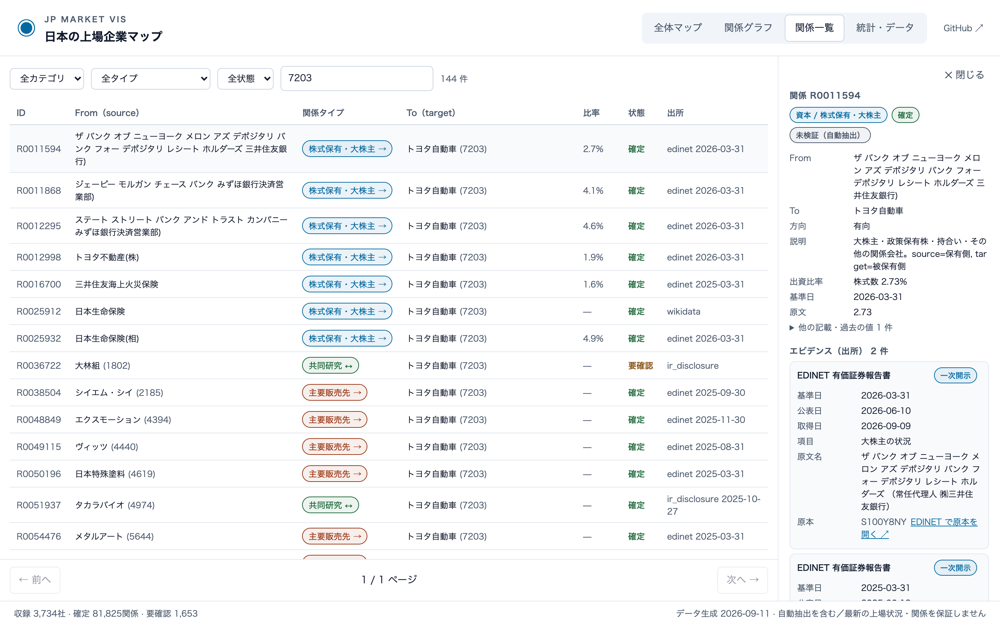
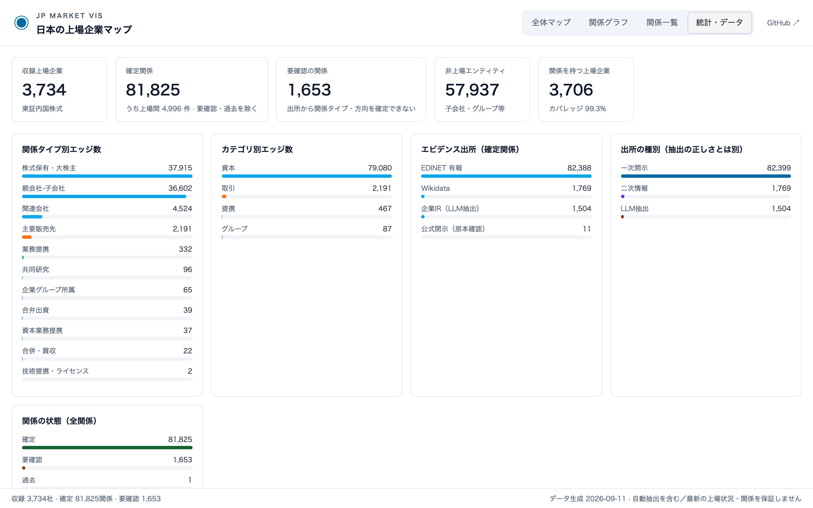
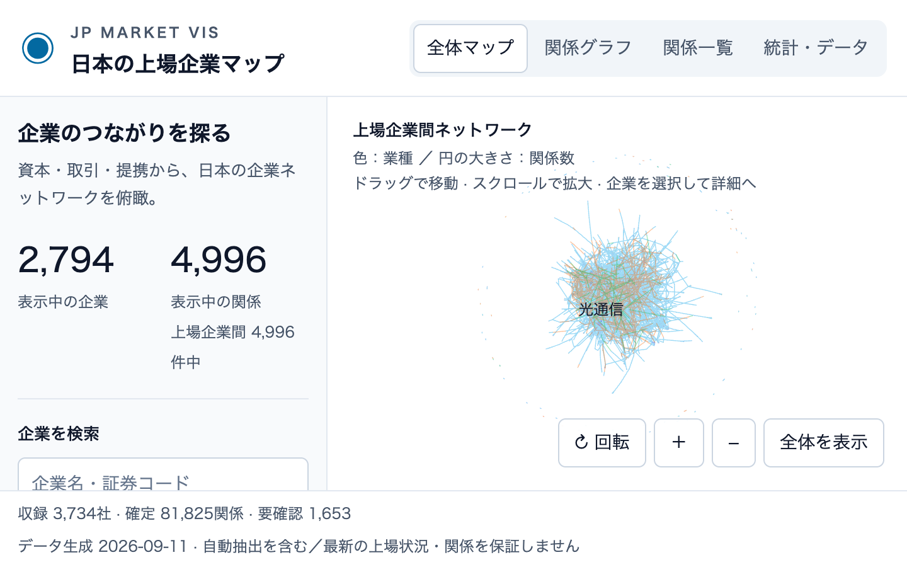
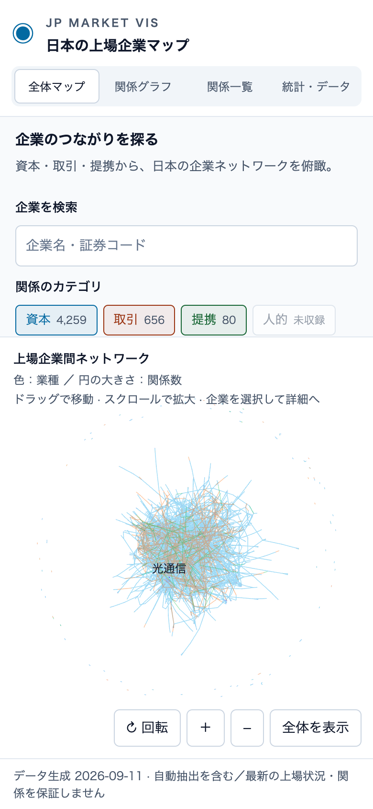
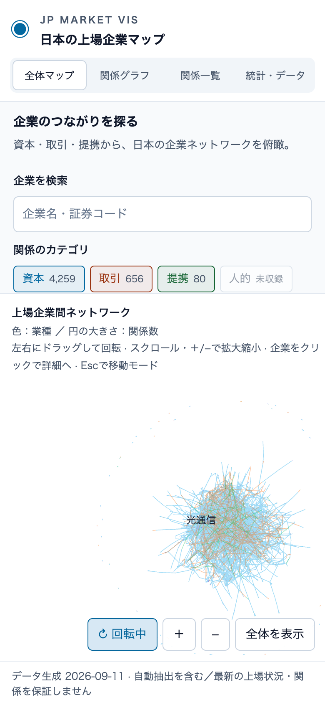
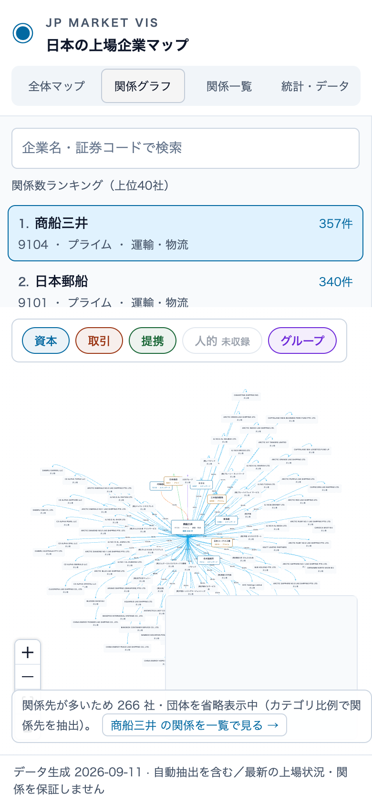

# 実操作レビュー結果 2026-09-11

- 対象コミット: `fc3f539902d6d51b6a376c08926a692442ded43d`
- URL: http://localhost:5184/JP_Market_Vis/
- ブラウザ: Chrome 152.0.7977.83 (headless, Playwright)
- 端末: darwin arm64（PC 1440×900 / 200%拡大相当 720×450 / タッチ 390×844 はエミュレーション。実機は未実施）
- 結果: 55/55 合格

| シナリオ | 項目 | 結果 | 補足 |
| --- | --- | --- | --- |
| ロード | 余計な文言なし（件数・容量・技術説明を含まない） | 合格 | "読み込み中" |
| ロード | 読み込み状態を支援技術に伝える（role=status＋「読み込み中」） | 合格 |  |
| ロード | 白基調の背景 | 合格 | rgb(255, 255, 255) |
| ロード | 最小限の要素（インジケーターと文言のみ） | 合格 | 2 要素 |
| ロード | 文言は数秒後に「読み込み中」だけを表示 | 合格 | 0 -> 1 |
| ロード | 完了後に本画面へ遷移（ロード画面が残らない） | 合格 |  |
| ロード | コンソールエラーなし | 合格 |  |
| ロード | 狭い画面で横スクロールなし | 合格 |  |
| ロード | 失敗時に簡潔なエラー表示（無限ローディングにならない） | 合格 | データを読み込めませんでした  再試行 |
| ロード | 再試行で本画面を表示 | 合格 |  |
| PC初回 | 初回表示（マップ描画まで） | 合格 | 1099 ms |
| PC初回 | コンソールエラーなし | 合格 |  |
| PC初回 | 横スクロールなし | 合格 |  |
| PC初回 | 見出し・操作部品の重なりなし | 合格 | {"capTools":false} |
| 視認性 | 文字コントラスト 4.5:1（PC 全体マップ） | 合格 | 55 要素 |
| 操作 | 回転ON | 合格 |  |
| 操作 | 回転中のホイール拡大 | 合格 | 0.20736882090568542 -> 0.23847414553165436 |
| 操作 | 連続ドラッグ後、詳細を誤って開かない | 合格 |  |
| 負荷 | 回転ドラッグ中の再描画回数（約0.6秒） | 合格 | 61 |
| 負荷 | 回転ON停止中の再描画回数/秒 | 合格 | 0 |
| 操作 | 外側リリース後の再ドラッグで固着なし | 合格 |  |
| 操作 | 矢印キー・Escで移動モードに戻る | 合格 |  |
| 操作 | 回転後のクリックで見た目どおりの企業が開く | 合格 | テノ．ホールディングス -> テノ．ホールディングス |
| フィルタ | 全解除で空状態を表示 | 合格 |  |
| フィルタ | 初期状態に戻すで復帰 | 合格 |  |
| フィルタ | 閾値20で表示線なし件数を表示 | 合格 | 30 表示中の企業 うち表示線なし 19社 7 表示中の関係 上場企業間 4,996件中 |
| フィルタ | 未収録カテゴリが無効化されている | 合格 |  |
| 往復 | 関係グラフでエッジを選択して詳細を表示 | 合格 |  |
| 視認性 | 文字コントラスト 4.5:1（PC 関係グラフ＋詳細） | 合格 | 493 要素 |
| 往復 | 全体マップの検索・カテゴリ・件数を復元 | 合格 |  |
| 一覧 | 0件表示 | 合格 |  |
| 一覧 | 1ページ300件の境界 | 合格 | 300行 / 1 / 279 ページ |
| 一覧 | ページ送り | 合格 |  |
| 一覧 | 検索変更で1ページ目に戻る | 合格 |  |
| 一覧 | 詳細を開く | 合格 |  |
| 視認性 | 文字コントラスト 4.5:1（PC 関係一覧＋詳細） | 合格 | 1435 要素 |
| 一覧 | 詳細を閉じる | 合格 |  |
| 統計 | 統計・データを表示 | 合格 |  |
| 視認性 | 文字コントラスト 4.5:1（PC 統計・データ） | 合格 | 215 要素 |
| キーボード | Tabで検索欄に到達 | 合格 | BUTTON:全体マップ, BUTTON:関係グラフ, BUTTON:関係一覧, BUTTON:統計・データ, A:GitHub ↗, INPUT:map-search, BUTTON:資本4,259, BUTTON:取引656, BUTTON:提携80, BUTTON:グループ1, INPUT:min-degree, SUMMARY:業種の凡例, BUTTON:↻ 回転, BUTTON:拡大, BUTTON:縮小, BUTTON:全体を表示, BODY:◉JP MARKET V |
| キーボード | Tabで表示切替タブに到達 | 合格 |  |
| キーボード | Tabで回転ボタンに到達 | 合格 |  |
| キーボード | 回転ONで回転領域にフォーカスが移る | 合格 |  |
| キーボード | Escで回転終了 | 合格 |  |
| 200% | 横スクロールなし | 合格 |  |
| 200% | 最小関係数スライダーにスクロールで到達 | 合格 |  |
| 200% | 一覧の操作部品が表示される | 合格 |  |
| タッチ | 横スクロールなし | 合格 |  |
| タッチ | 空き領域のタップで画面が切り替わらない | 合格 |  |
| タッチ | マップ上のスワイプでページがスクロールしない | 合格 |  |
| タッチ | 回転モードのスワイプで固着なし・エラーなし | 合格 |  |
| タッチ | 関係グラフを表示 | 合格 |  |
| タッチ | 一覧から詳細を開く | 合格 |  |
| 視認性 | 文字コントラスト 4.5:1（タッチ 一覧＋詳細） | 合格 | 2735 要素 |
| タッチ | コンソールエラーなし | 合格 |  |

## スクリーンショット

- 
- 
- 
- 
- 
- 
- 
- 
- 
- 
- 
- 
- 
- 
- 

## 未実施・注記

- タッチ操作はヘッドレス Chrome のエミュレーション（hasTouch / CDP のタッチイベント）で、実機ではない。
- 描画負荷は canvas の clearRect 呼び出し回数を再描画回数として計測したもので、CPU 使用率・FPS の実測ではない。
- 低速通信は Playwright のルートで M5 の取得を 4 秒遅らせる代替、読み込み失敗はルートの中断で再現した（実回線ではない）。
- データの事実精度の評価はこのレビューの対象外（Issue #3 の監査を参照）。
