# 実操作レビュー結果 2026-09-12

- 対象コミット: `4d6dc0af2b157e6a463b5f8f73102ce230f55ee0`
- URL: http://localhost:5184/JP_Market_Vis/
- ブラウザ: Chrome 152.0.7977.83 (headless, Playwright)
- 端末: darwin arm64（PC 1440×900 / 200%拡大相当 720×450 / タッチ 390×844 はエミュレーション。実機は未実施）
- 結果: 67/67 合格

| シナリオ | 項目 | 結果 | 補足 |
| --- | --- | --- | --- |
| ロード | 余計な文言なし（件数・容量・技術説明を含まない） | 合格 | "読み込み中" |
| ロード | 読み込み状態を支援技術に伝える（role=status＋「読み込み中」） | 合格 |  |
| ロード | 白基調の背景 | 合格 | rgb(255, 255, 255) |
| ロード | 最小限の要素（インジケーターと文言のみ） | 合格 | 2 要素 |
| ロード | 文言は数秒後に「読み込み中」だけを表示 | 合格 | 0 -> 1 |
| ロード | 完了後に本画面へ遷移（ロード画面が残らない） | 合格 |  |
| ロード | コンソールエラーなし | 合格 |  |
| ロード | 狭い画面で横スクロールなし | 合格 |  |
| ロード | 失敗時に簡潔なエラー表示（無限ローディングにならない） | 合格 | データを読み込めませんでした  再試行 |
| ロード | 再試行で本画面を表示 | 合格 |  |
| PC初回 | 初回表示（マップ描画まで） | 合格 | 3484 ms |
| PC初回 | コンソールエラーなし | 合格 |  |
| PC初回 | 横スクロールなし | 合格 |  |
| PC初回 | 見出し・操作部品の重なりなし | 合格 | {"capTools":false} |
| 視認性 | 文字コントラスト 4.5:1（PC 全体マップ） | 合格 | 55 要素 |
| 3D | ノードが奥行きを持って配置される（z 方向の広がり） | 合格 | z 範囲 4033 |
| 3D | ドラッグで視点が水平・垂直に回転する | 合格 | 0,0,5303 -> -4466,2339,1644 |
| 3D | ドラッグ終了で詳細を誤って開かない | 合格 |  |
| 負荷 | ドラッグ中の WebGL 描画呼び出し（約0.6秒） | 合格 | 521930 |
| 負荷 | 停止中の WebGL 描画呼び出し/秒 | 合格 | 0 |
| 3D | 描画休止中のリサイズ後に再描画される（ポインター操作なし） | 合格 | 373920 回 |
| 負荷 | リサイズ後も停止中は描画休止 | 合格 | 0 |
| 3D | ホイールで拡大（カメラが近づく） | 合格 | 5303 -> 4910 |
| 3D | ＋ボタンで拡大 | 合格 |  |
| 3D | 視点リセットで正面から全体を見る向きに戻る | 合格 | 0,0,5303 |
| 3D | 外側リリース後の再ドラッグで固着なし | 合格 |  |
| 3D | ホバー状態がノードに反映される | 合格 | hover=7867 (タカラトミー) |
| 3D | 回転後のクリックで見た目どおりの企業が開く | 合格 | タカラトミー -> タカラトミー |
| フィルタ | 全解除で空状態を表示 | 合格 |  |
| フィルタ | 初期状態に戻すで復帰 | 合格 |  |
| フィルタ | 閾値20で表示線なし件数を表示 | 合格 | 30 表示中の企業 うち表示線なし 19社 7 表示中の関係 上場企業間 4,996件中 |
| フィルタ | 未収録カテゴリが無効化されている | 合格 |  |
| フィルタ | グループのみ（低次数の企業だけ）でも視点が収まる | 合格 | 1094 -> 120 / 2 表示中の企業 1 表示中の関係 上場企業間 4,996件中 |
| フィルタ | グループのみで視点リセットが機能する | 合格 | 120 |
| 往復 | 関係グラフでエッジを選択して詳細を表示 | 合格 |  |
| 視認性 | 文字コントラスト 4.5:1（PC 関係グラフ＋詳細） | 合格 | 493 要素 |
| 往復 | 全体マップの検索・カテゴリ・件数を復元 | 合格 |  |
| 一覧 | 0件表示 | 合格 |  |
| 一覧 | 1ページ300件の境界 | 合格 | 300行 / 1 / 279 ページ |
| 一覧 | ページ送り | 合格 |  |
| 一覧 | 検索変更で1ページ目に戻る | 合格 |  |
| 一覧 | 詳細を開く | 合格 |  |
| 視認性 | 文字コントラスト 4.5:1（PC 関係一覧＋詳細） | 合格 | 1435 要素 |
| 一覧 | 詳細を閉じる | 合格 |  |
| 統計 | 統計・データを表示 | 合格 |  |
| 視認性 | 文字コントラスト 4.5:1（PC 統計・データ） | 合格 | 215 要素 |
| キーボード | Tabで検索欄に到達 | 合格 | BUTTON:全体マップ, BUTTON:関係グラフ, BUTTON:関係一覧, BUTTON:統計・データ, A:GitHub ↗, INPUT:map-search, BUTTON:資本4,259, BUTTON:取引656, BUTTON:提携80, BUTTON:グループ1, INPUT:min-degree, SUMMARY:業種の凡例, DIV:上場企業間ネットワークの 3D 表示。ドラッグで視点を回転、スクロールで拡大縮小。左右の矢印キーで水平に、上下の矢印キーで垂直に回転、＋／−で拡大縮小、0 で視点をリセットできます。企業をクリックすると関係グラフを開きます。, BUTTON |
| キーボード | Tabで表示切替タブに到達 | 合格 |  |
| キーボード | Tabでマップ領域（3D）に到達 | 合格 |  |
| キーボード | Tabで拡大・縮小・視点リセットに到達 | 合格 |  |
| キーボード | 左右矢印キーで視点を水平に回転 | 合格 | 0,0,5303 -> 1372,0,5122 |
| キーボード | 上下矢印キーで視点を垂直に回転 | 合格 | 1372,0,5122 -> 1361,692,5078 |
| キーボード | −キーで縮小（カメラが離れる） | 合格 | 5303 -> 7423 |
| キーボード | 0キーで視点リセット | 合格 | 0,0,5303 |
| 200% | 横スクロールなし | 合格 |  |
| 200% | 最小関係数スライダーにスクロールで到達 | 合格 |  |
| 200% | 一覧の操作部品が表示される | 合格 |  |
| タッチ | 横スクロールなし | 合格 |  |
| タッチ | 向き変更後に再描画される（ポインター操作なし） | 合格 | 389500 回 |
| タッチ | 向き変更後も横スクロールなし | 合格 |  |
| タッチ | 空き領域のタップで画面が切り替わらない | 合格 |  |
| タッチ | マップ上のスワイプでページがスクロールしない | 合格 |  |
| タッチ | スワイプで視点が回転し、固着・エラーなし | 合格 | -4000,5089,1814 -> -1210,5089,-4222 |
| タッチ | 関係グラフを表示 | 合格 |  |
| タッチ | 一覧から詳細を開く | 合格 |  |
| 視認性 | 文字コントラスト 4.5:1（タッチ 一覧＋詳細） | 合格 | 2735 要素 |
| タッチ | コンソールエラーなし | 合格 |  |

## スクリーンショット

- 
- 
- 
- 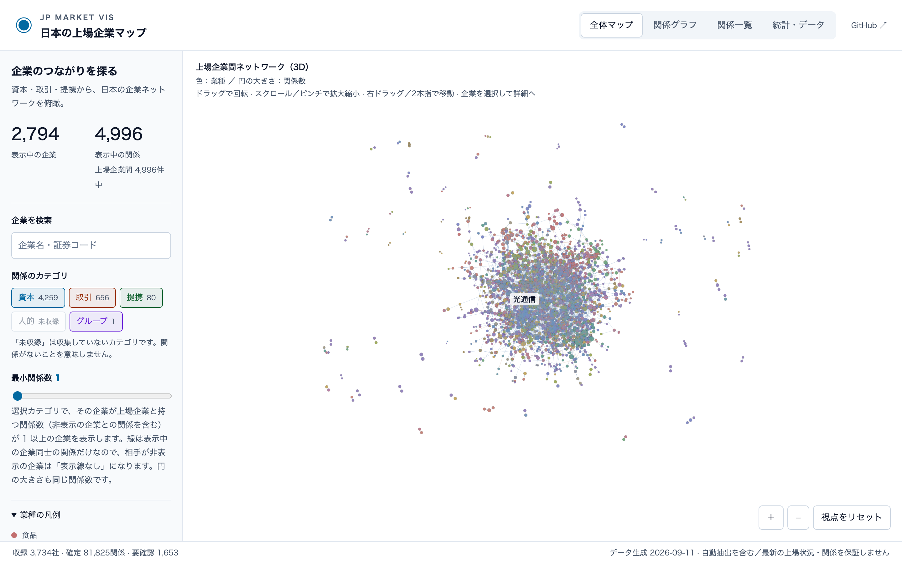
- 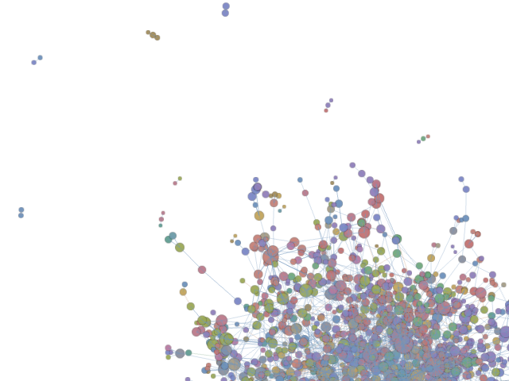
- 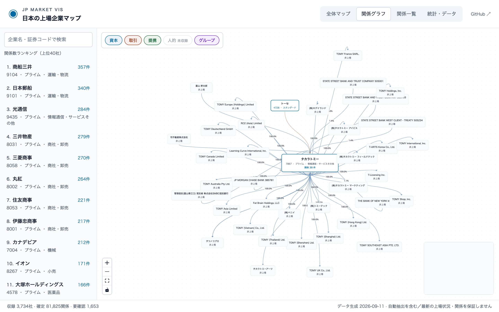
- 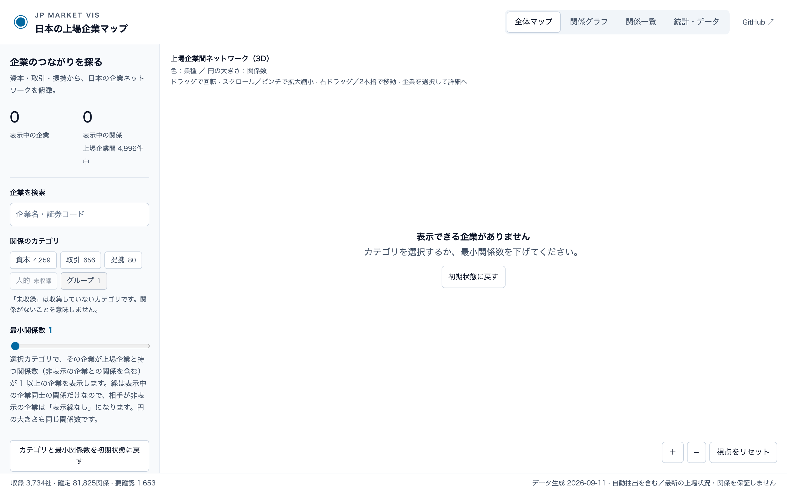
- 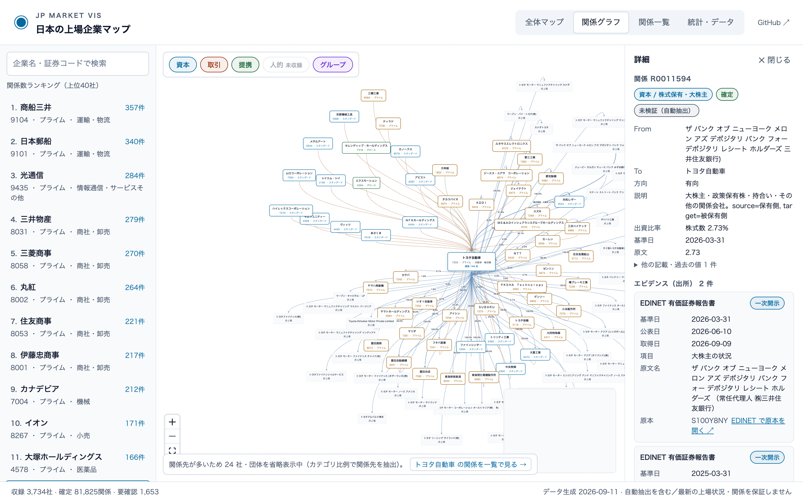
- 
- 
- 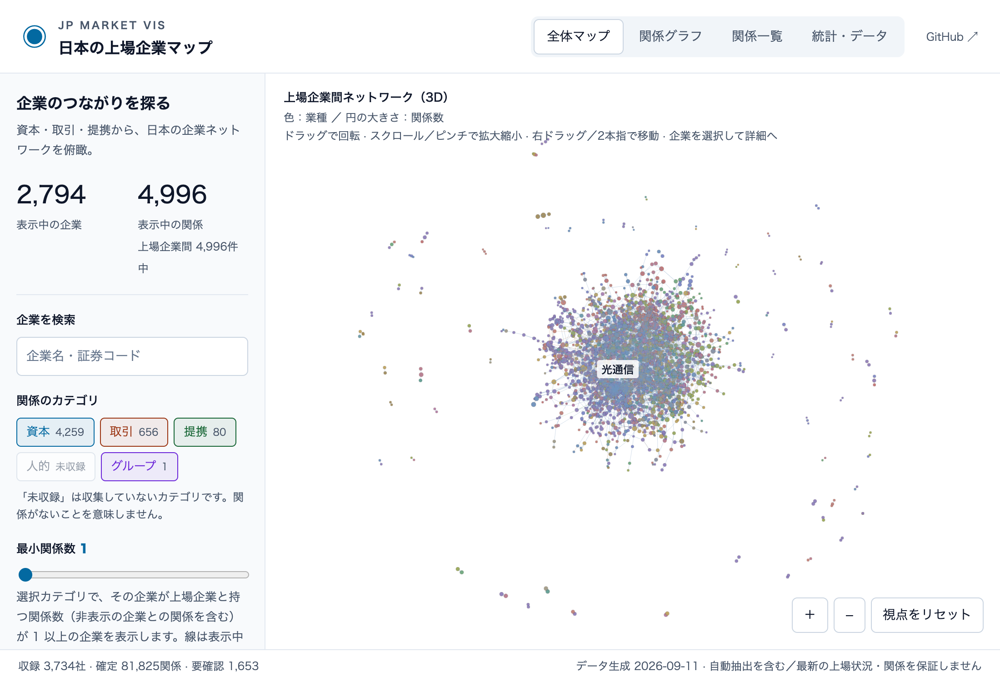
- 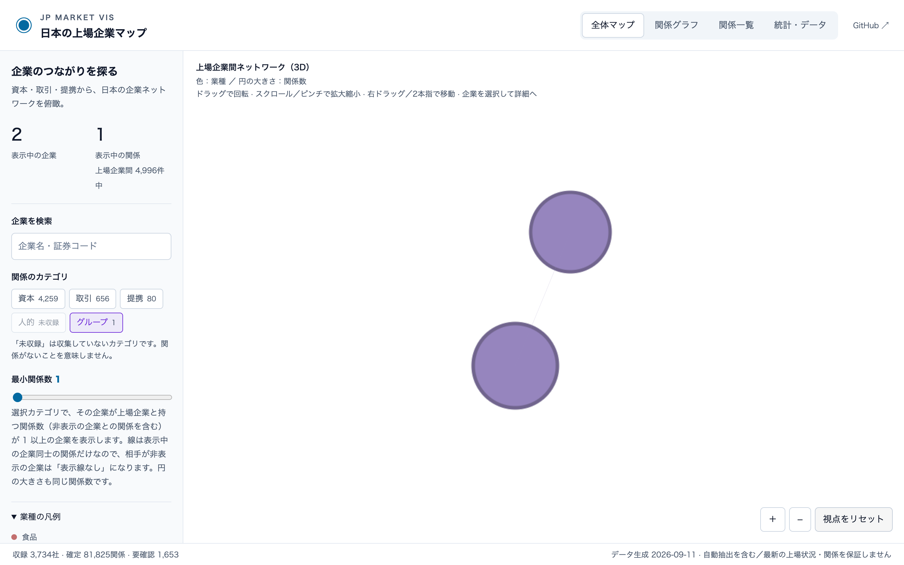
- 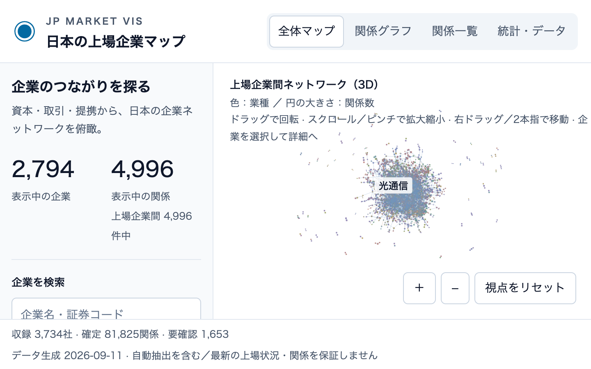
- 
- 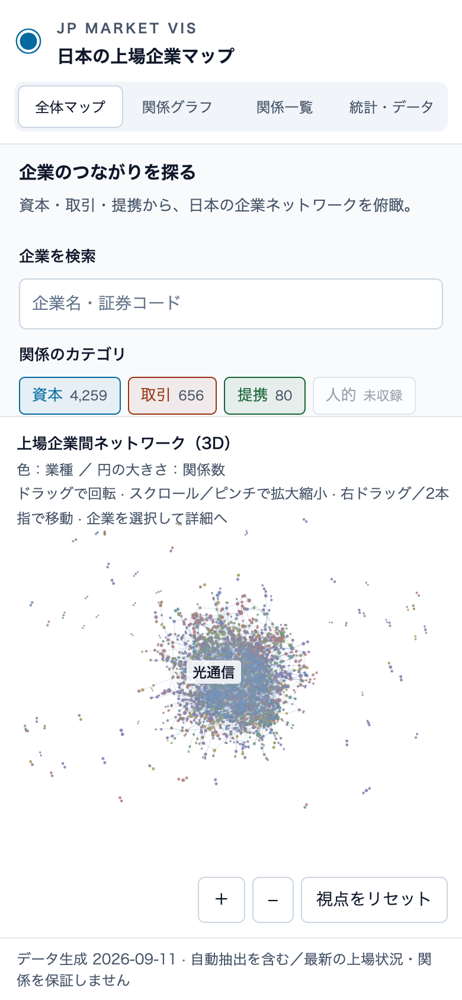
- 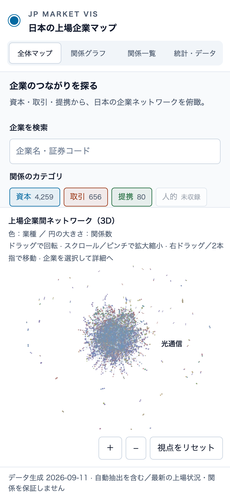
- 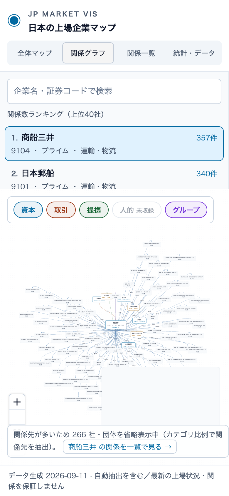
- 
- 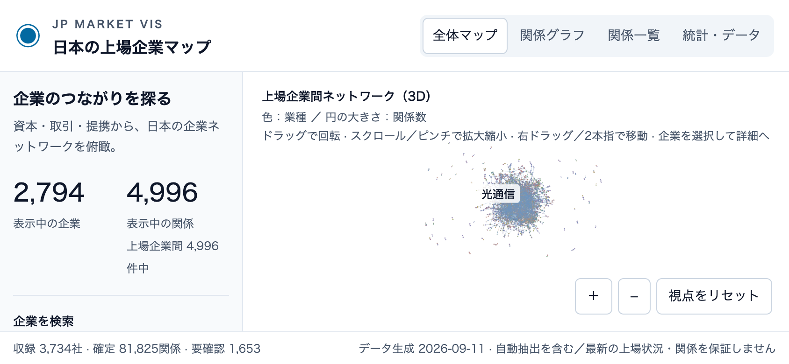

## 未実施・注記

- タッチ操作はヘッドレス Chrome のエミュレーション（hasTouch / CDP のタッチイベント）で、実機ではない。
- 描画負荷は WebGL の描画呼び出し（drawElements / drawArrays）回数を計測したもので、CPU・GPU 使用率・FPS の実測ではない。
- 視点の向きは .map-canvas の data-camera（注視点からのカメラ相対位置）、奥行きは data-depth（ノードの z 範囲）で確認した。
- 低速通信は Playwright のルートで M5 の取得を 4 秒遅らせる代替、読み込み失敗はルートの中断で再現した（実回線ではない）。
- データの事実精度の評価はこのレビューの対象外（Issue #3 の監査を参照）。
