# 実操作レビュー結果 2026-09-20

- 対象コミット: `4e358df8e7d0105ca36617cfb3486b9dbd854ccb`
- URL: http://localhost:5184/JP_Market_Vis/
- ブラウザ: Chrome 153.0.8010.48 (headless, Playwright)
- 端末: darwin arm64（PC 1440×900 / 200%拡大相当 720×450 / タッチ 390×844 はエミュレーション。実機は未実施）
- 結果: 78/78 合格

| シナリオ | 項目 | 結果 | 補足 |
| --- | --- | --- | --- |
| ロード | 余計な文言なし（件数・容量・技術説明を含まない） | 合格 | "読み込み中" |
| ロード | 読み込み状態を支援技術に伝える（role=status＋「読み込み中」） | 合格 |  |
| ロード | 白基調の背景 | 合格 | rgb(255, 255, 255) |
| ロード | 最小限の要素（インジケーターと文言のみ） | 合格 | 2 要素 |
| ロード | 文言は数秒後に「読み込み中」だけを表示 | 合格 | 0 -> 1 |
| ロード | 完了後に本画面へ遷移（ロード画面が残らない） | 合格 |  |
| ロード | コンソールエラーなし | 合格 |  |
| ロード | 狭い画面で横スクロールなし | 合格 |  |
| ロード | 失敗時に簡潔なエラー表示（無限ローディングにならない） | 合格 | データを読み込めませんでした  再試行 |
| ロード | 再試行で本画面を表示 | 合格 |  |
| PC初回 | 初回表示（マップ描画まで） | 合格 | 1255 ms |
| PC初回 | コンソールエラーなし | 合格 |  |
| PC初回 | 横スクロールなし | 合格 |  |
| PC初回 | 見出し・操作部品の重なりなし | 合格 | {"capTools":false} |
| 視認性 | 文字コントラスト 4.5:1（PC 全体マップ） | 合格 | 56 要素 |
| 2D | 初期表示で全体が収まる（倍率が確定している） | 合格 | k=0.402 中心(115,-33) |
| 2D | ドラッグで表示位置が移動する（倍率は変わらない） | 合格 | k=0.402 中心(115,-33) -> k=0.402 中心(-263,-175) |
| 2D | ドラッグ終了で詳細を誤って開かない | 合格 |  |
| 負荷 | ドラッグ中の描画（約0.6秒） | 合格 | 27 |
| 負荷 | 停止中の描画/秒 | 合格 | 0 |
| 2D | 描画休止中のリサイズ後に再描画される（ポインター操作なし） | 合格 | 6 回 |
| 負荷 | リサイズ後も停止中は描画休止 | 合格 | 0 |
| 2D | ホイールで拡大（倍率が上がる） | 合格 | 0.402 -> 0.495 |
| 2D | ＋ボタンで拡大 | 合格 | 0.495 -> 0.693 |
| 2D | 「全体を表示」で初期表示と同じ倍率・位置に戻る | 合格 | k=0.402 中心(115,-33) / 初期 k=0.402 中心(115,-33) |
| 2D | 外側リリース後の再ドラッグで固着なし | 合格 |  |
| 2D | ホバー状態がノードに反映される | 合格 | hover=6193 (バーチャレクス・ホールディングス) |
| 2D | 円の内側だけがホバー対象（拡大した全体表示） | 合格 | バーチャレクス・ホールディングス 中心(473,197) r=9.0 中心=バーチャレクス・ホールディングス 内側=バーチャレクス・ホールディングス 外側=なし/なし/なし/スクウェア・エニックス・ホールディングス |
| 2D | 円の中心のクリックで同じ企業が開く（拡大した全体表示） | 合格 | バーチャレクス・ホールディングス -> バーチャレクス・ホールディングス |
| フィルタ | 全解除で空状態を表示 | 合格 |  |
| フィルタ | 初期状態に戻すで復帰 | 合格 |  |
| フィルタ | 閾値20で表示線なし件数を表示 | 合格 | 94 表示中の企業 うち表示線なし 9社 224 表示中の関係 上場企業間 11,065件中 |
| フィルタ | 未収録カテゴリだけが無効化されている | 合格 | 無効 0 / 未収録表示 0 |
| フィルタ | 人的カテゴリが収録され有効（未収録でない） | 合格 | 人的 5,460 |
| フィルタ | グループカテゴリが収録され有効（未収録でない） | 合格 | グループ 184 |
| フィルタ | 提携カテゴリが収録され有効（未収録でない） | 合格 | 提携 481 |
| 2D | 配置計算中のズームが引き戻されない（倍率が単調に上がり、その後も保たれる） | 合格 | 0.345 0.364 0.385 0.407 0.430 0.455 0.481 0.508 0.537 / 2.5秒後 0.537 |
| フィルタ | 絞り込んだ小さな表示（グループのみ・最小関係数 2）でも表示中の企業が収まる | 合格 | k=0.402 中心(115,-33) -> k=1.507 中心(-3,-33) / 23 表示中の企業 うち表示線なし 6社 20 表示中の関係 上場企業間 11,065件中 |
| フィルタ | 絞り込んだ表示で「全体を表示」が機能する | 合格 | k=1.507 中心(-3,-33) |
| フィルタ | グループのハブにホバーすると企業グループと会員数を表示 | 合格 | イオングループ 企業グループ 会員の上場企業 4社（子会社が会員の場合は上場親会社） |
| 2D | 円の内側だけがホバー対象（グループのみ・最小関係数 2） | 合格 | 阪急阪神ホールディングス 中心(870,462) r=7.2 中心=阪急阪神ホールディングス 内側=阪急阪神ホールディングス 外側=なし/なし/なし/なし |
| 2D | 円の中心のクリックで同じ企業が開く（グループのみ・最小関係数 2） | 合格 | 阪急阪神ホールディングス -> 阪急阪神ホールディングス |
| 往復 | 中心企業にホバーしても線の種別ラベルが増えない（崩れない） | 合格 | 線 130 本 / 種別ラベル 0 -> 0 |
| 往復 | ミニマップにノードが描かれる | 合格 | 91 個 |
| 往復 | 関係グラフでエッジを選択して詳細を表示 | 合格 |  |
| 視認性 | 文字コントラスト 4.5:1（PC 関係グラフ＋詳細） | 合格 | 489 要素 |
| 往復 | 全体マップの検索・カテゴリ・件数を復元 | 合格 |  |
| 一覧 | 0件表示 | 合格 |  |
| 一覧 | 1ページ300件の境界 | 合格 | 300行 / 1 / 303 ページ |
| 一覧 | ページ送り | 合格 |  |
| 一覧 | 検索変更で1ページ目に戻る | 合格 |  |
| 一覧 | 詳細を開く | 合格 |  |
| 視認性 | 文字コントラスト 4.5:1（PC 関係一覧＋詳細） | 合格 | 1677 要素 |
| 一覧 | 詳細を閉じる | 合格 |  |
| 統計 | 統計・データを表示 | 合格 |  |
| 視認性 | 文字コントラスト 4.5:1（PC 統計・データ） | 合格 | 221 要素 |
| キーボード | Tabで検索欄に到達 | 合格 | BUTTON:全体マップ, BUTTON:関係グラフ, BUTTON:関係一覧, BUTTON:統計・データ, A:GitHub ↗, INPUT:map-search, BUTTON:資本4,282, BUTTON:取引658, BUTTON:提携481, BUTTON:人的5,460, BUTTON:グループ184, INPUT:min-degree, SUMMARY:業種の凡例, DIV:上場企業間ネットワーク。ドラッグで移動、スクロールで拡大縮小。矢印キーで移動、＋／−で拡大縮小、0 で全体を表示できます。企業をクリックすると関係グラフを開きます。, BUTTON:拡大, BUTTON |
| キーボード | Tabで表示切替タブに到達 | 合格 |  |
| キーボード | Tabでマップ領域に到達 | 合格 |  |
| キーボード | Tabで拡大・縮小・全体を表示に到達 | 合格 |  |
| キーボード | 左右矢印キーで表示位置を水平に移動 | 合格 | k=0.402 中心(115,-33) -> k=0.402 中心(314,-33) |
| キーボード | 上下矢印キーで表示位置を垂直に移動 | 合格 | k=0.402 中心(314,-33) -> k=0.402 中心(314,-232) |
| キーボード | −キーで縮小（倍率が下がる） | 合格 | 0.402 -> 0.287 |
| キーボード | 0キーで全体を表示（初期の倍率・位置に戻る） | 合格 | k=0.402 中心(115,-33) / 初期 k=0.402 中心(115,-33) |
| 200% | 横スクロールなし | 合格 |  |
| 200% | 最小関係数スライダーにスクロールで到達 | 合格 |  |
| 200% | 一覧の操作部品が表示される | 合格 |  |
| タッチ | 横スクロールなし | 合格 |  |
| タッチ | 向き変更後に再描画される（ポインター操作なし） | 合格 | 6 回 |
| タッチ | 向き変更後も横スクロールなし | 合格 |  |
| タッチ | 空き領域のタップで画面が切り替わらない | 合格 |  |
| タッチ | マップ上のスワイプでページがスクロールしない | 合格 |  |
| タッチ | スワイプで表示位置が移動し、固着・エラーなし | 合格 | k=0.179 中心(-332,-368) -> k=0.179 中心(-1003,-368) |
| タッチ | ピンチで拡大（倍率が上がる） | 合格 | 0.179 -> 0.536 |
| タッチ | 関係グラフを表示 | 合格 |  |
| タッチ | 一覧から詳細を開く | 合格 |  |
| 視認性 | 文字コントラスト 4.5:1（タッチ 一覧＋詳細） | 合格 | 2738 要素 |
| タッチ | コンソールエラーなし | 合格 |  |

## スクリーンショット

- 
- 
- 
- 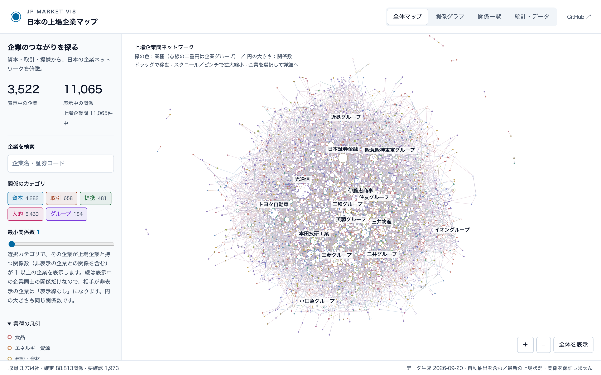
- 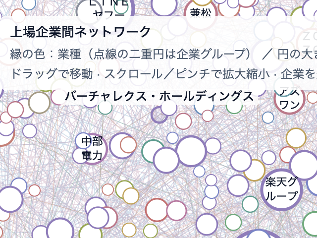
- 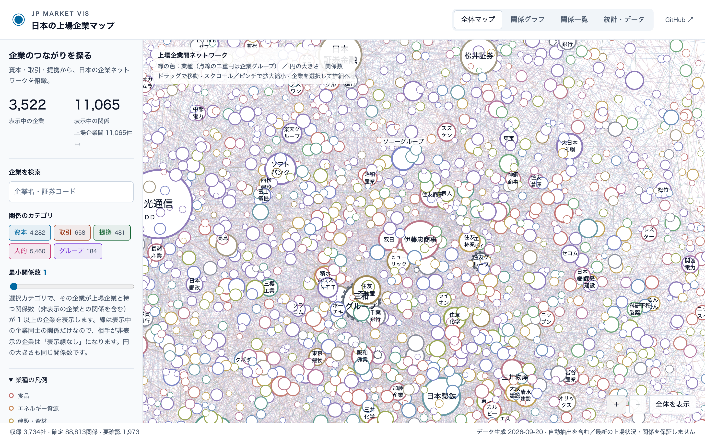
- 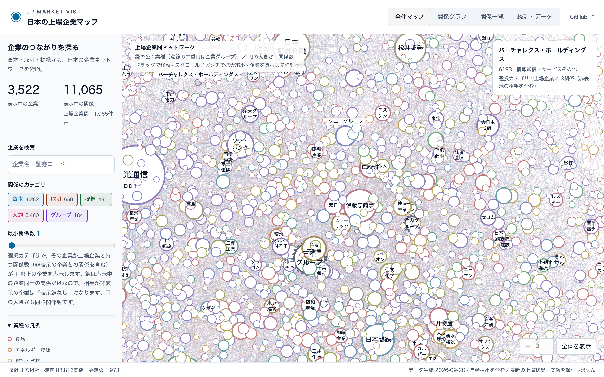
- 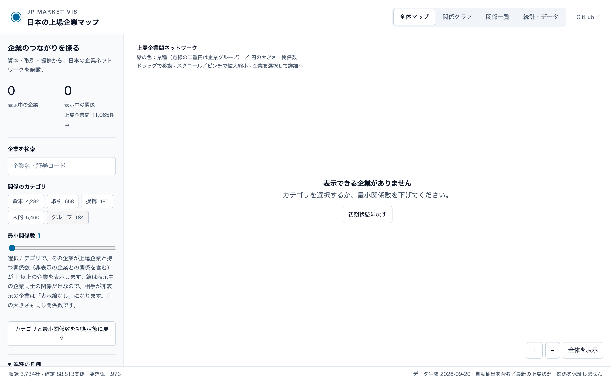
- 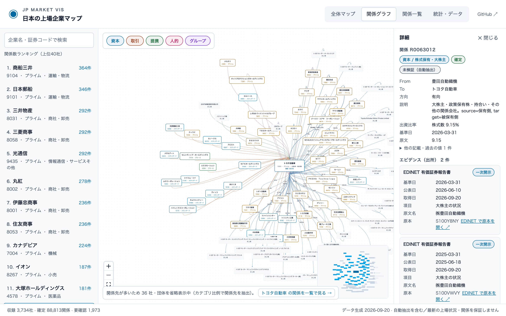
- 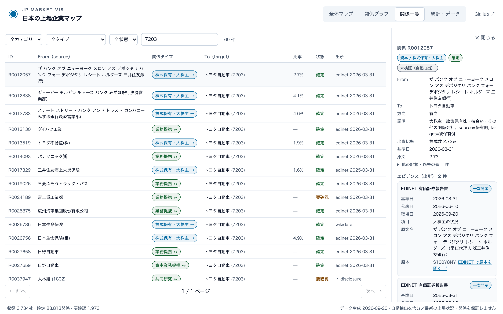
- 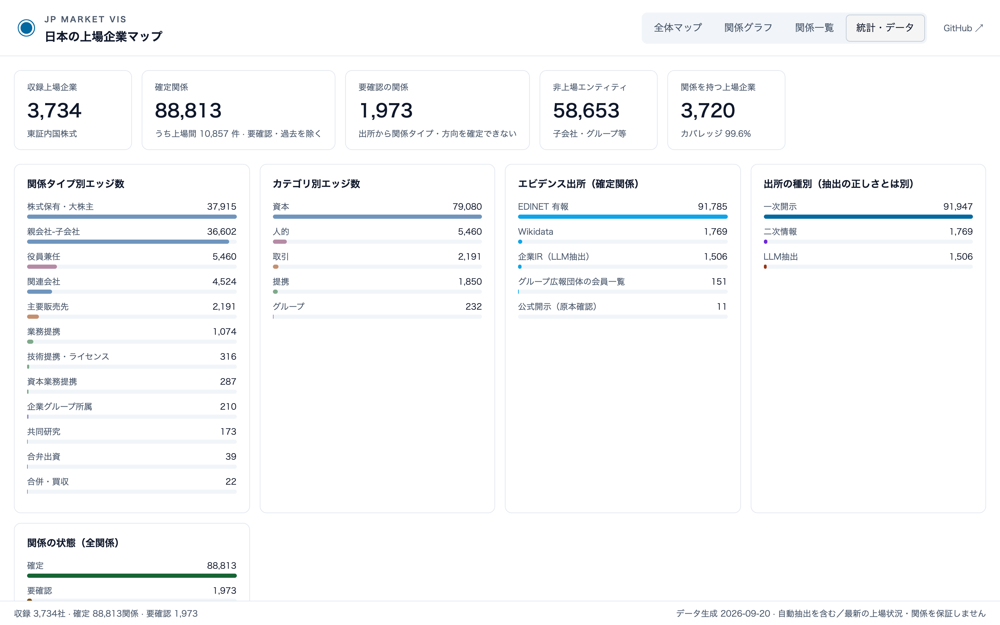
- 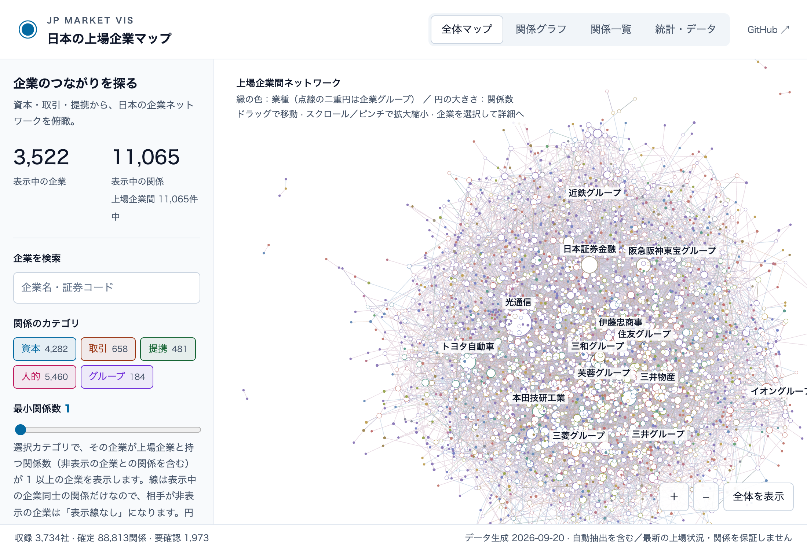
- 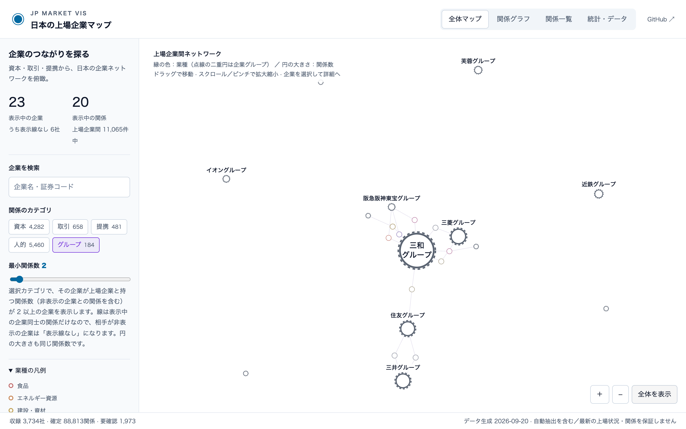
- 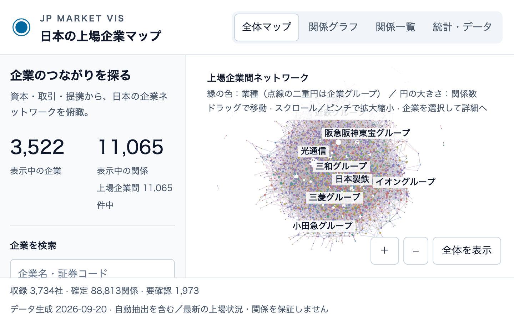
- 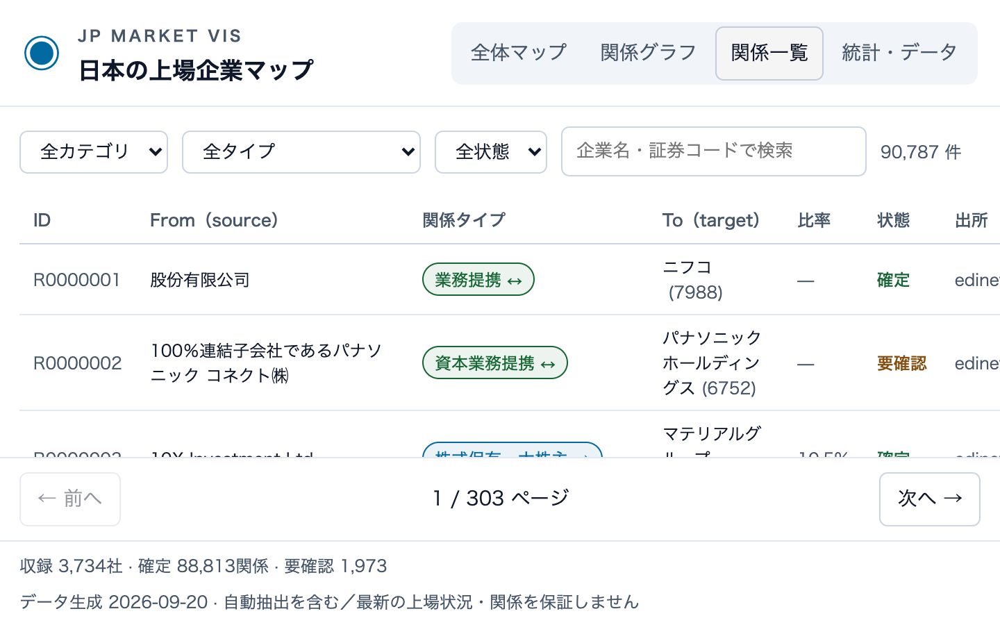
- 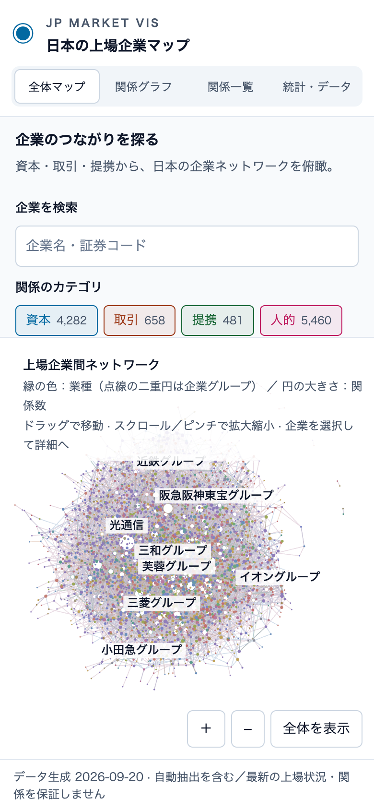
- 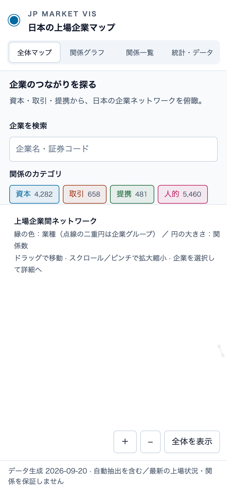
- 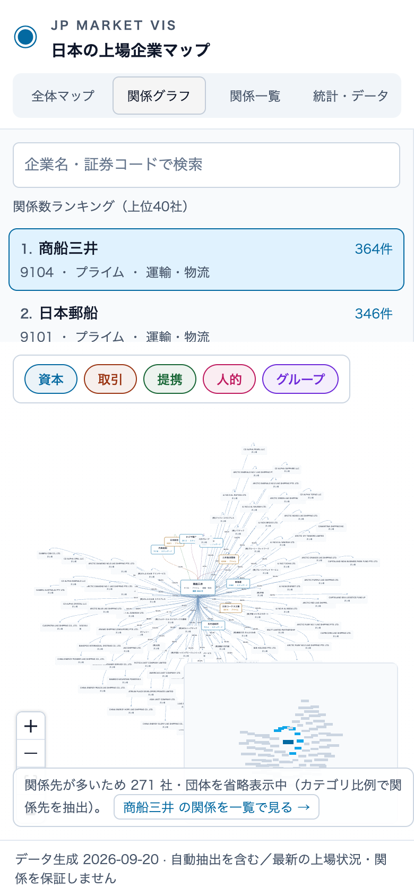
- 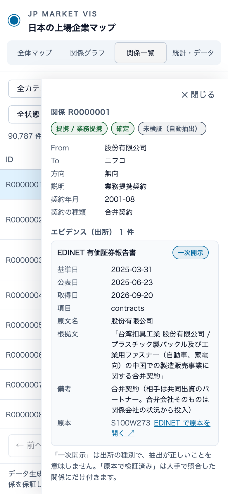
- 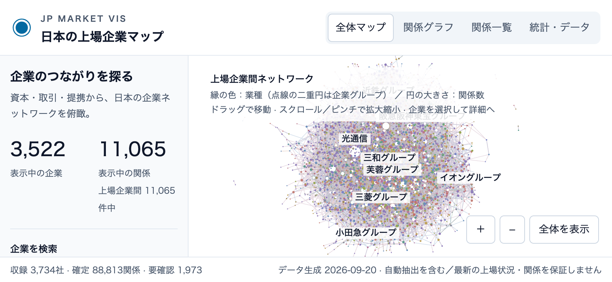

## 未実施・注記

- タッチ操作はヘッドレス Chrome のエミュレーション（hasTouch / CDP のタッチイベント）で、実機ではない。
- 描画負荷は Canvas 2D の clearRect 回数（フレームごとに 2 回）を計測したもので、CPU・GPU 使用率・FPS の実測ではない。
- 倍率と表示位置は .map-canvas の data-view（倍率,中心x,中心y）、ホバー中のノードの画面上の中心と半径は data-hover-center / data-hover-radius で確認した。
- 低速通信は Playwright のルートで M5 の取得を 4 秒遅らせる代替、読み込み失敗はルートの中断で再現した（実回線ではない）。
- データの事実精度の評価はこのレビューの対象外（Issue #3 の監査を参照）。
